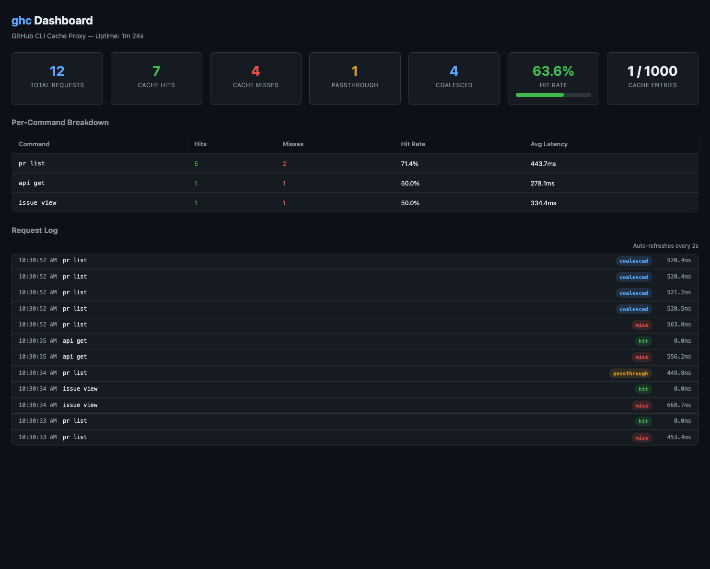

# ghc — GitHub CLI Cache Proxy

<p align="center">
  
</p>

A caching proxy for the [GitHub CLI (`gh`)](https://cli.github.com/) that eliminates redundant API calls, prevents rate limiting, and dramatically speeds up repeated commands.

**Built for AI agent workflows** where multiple agents (Copilot CLI, coding agents, MCP servers) hammer the same `gh` commands simultaneously.

## Highlights

- 🚀 **10x faster** cached responses (~0.1s vs ~1s)
- 🔄 **Singleflight coalescing** — 5 agents asking the same thing = 1 API call
- 🎯 **Allowlist-based** — only caches known-safe read-only commands
- 🧹 **Auto-invalidation** — mutations flush related cache entries
- 📊 **Web dashboard** — real-time hit rates, per-command stats, request log
- 🔌 **Drop-in replacement** — just use `ghc` instead of `gh`

## Quick Start

### Install from source

```bash
git clone https://github.com/brunoborges/ghcd.git
cd ghcd
make build
```

This produces two binaries in `bin/`:
- **`ghc`** — the CLI client (drop-in `gh` replacement)
- **`ghcd`** — the cache daemon

Add `bin/` to your PATH, or copy both binaries somewhere in your PATH:

```bash
cp bin/ghc bin/ghcd /usr/local/bin/
```

### Install from release

```bash
# macOS (Apple Silicon)
curl -sL https://github.com/brunoborges/ghcd/releases/latest/download/ghcd-darwin-arm64.tar.gz | tar xz
cp ghc ghcd /usr/local/bin/

# macOS (Intel)
curl -sL https://github.com/brunoborges/ghcd/releases/latest/download/ghcd-darwin-amd64.tar.gz | tar xz
cp ghc ghcd /usr/local/bin/

# Linux (amd64)
curl -sL https://github.com/brunoborges/ghcd/releases/latest/download/ghcd-linux-amd64.tar.gz | tar xz
cp ghc ghcd /usr/local/bin/
```

## Usage

Use `ghc` exactly like `gh` — the daemon starts automatically on first use:

```bash
# These are cached (read-only commands)
ghc pr list --repo owner/repo --json number,title
ghc issue view 42 --json title,state
ghc api /repos/owner/repo --jq '.stargazers_count'
ghc run list --repo owner/repo

# These pass through directly to gh (mutations)
ghc pr create --title "My PR" --body "Description"
ghc issue close 42
```

### Cache behavior

```
First call:   ghc pr list ...   → 1.1s (cache miss, calls gh)
Second call:  ghc pr list ...   → 0.1s (cache hit, instant)
After 30s:    ghc pr list ...   → 1.0s (TTL expired, fresh call)
```

### Per-command options

```bash
ghc --no-cache pr list ...     # Bypass cache for this call
ghc --ttl 120 pr list ...      # Override TTL to 120 seconds
GHC_NO_CACHE=1 ghc pr list ... # Same via env var
GHC_TTL=60 ghc pr list ...     # Same via env var
```

## Daemon Management

```bash
ghc daemon start          # Start in foreground
ghc daemon start -d       # Start detached (background)
ghc daemon stop           # Graceful shutdown
ghc daemon status         # Show uptime and cache stats
ghc daemon restart        # Stop + start
```

The daemon auto-starts on first `ghc` call. If the daemon can't start, `ghc` falls back to running `gh` directly — it never blocks you.

## Cache Management

```bash
ghc cache stats           # Show hit rates and per-command breakdown
ghc cache flush           # Flush all entries
ghc cache flush pr        # Flush PR-related entries only
ghc cache keys            # List cached keys (debugging)
```

### Example stats output

```
Uptime:          2h 34m
Total Requests:  1,247
Cache Hits:      891 (71.4%)
Cache Misses:    203 (16.3%)
Passthrough:     153 (12.3%)
Coalesced:       87
Cache Size:      142 / 1000 entries

Top Commands:
  pr list                  412 hits / 48 misses  (89.6%)
  issue view               198 hits / 32 misses  (86.1%)
  pr view                  143 hits / 67 misses  (68.1%)
  api get                   88 hits / 31 misses  (73.9%)
```

## Web Dashboard

When the daemon is running, a live dashboard is available at:

```
http://localhost:9847/
```

It shows:
- **Real-time hit rate** and request counters
- **Per-command breakdown** with hit/miss rates and average latency
- **Request log** — live tail of recent requests with cache result and timing

The dashboard auto-refreshes every 2 seconds. No external dependencies — it's a single HTML page embedded in the binary.

### JSON API

The dashboard data is also available as JSON for scripting:

```bash
curl http://localhost:9847/api/stats | jq .
curl http://localhost:9847/api/log?limit=50 | jq .
curl http://localhost:9847/api/ttl-analysis | jq .
```

## What Gets Cached

Only explicitly allowlisted read-only commands are cached:

| Command | Cached |
|---------|--------|
| `gh pr list/view/status/checks/diff` | ✅ |
| `gh issue list/view/status` | ✅ |
| `gh repo view` | ✅ |
| `gh run list/view` | ✅ |
| `gh workflow list/view` | ✅ |
| `gh release list/view` | ✅ |
| `gh search repos/issues/prs` | ✅ |
| `gh api` (GET only) | ✅ |
| `gh label list` | ✅ |
| `gh pr create/merge/close/edit` | ❌ (mutation → passthrough) |
| `gh auth/config/codespace` | ❌ (passthrough) |

Mutations automatically invalidate related cache entries. For example, `gh pr merge 42` flushes all cached PR entries for that repo.

## Configuration

Configuration file: `~/.ghc/config.yaml`

```yaml
# Default TTL for all cached commands (default: 30s)
ttl: 30s

# Per-command TTL overrides
ttl_overrides:
  pr_list: 60s
  pr_view: 30s
  issue_list: 60s
  run_list: 15s

# Max cached entries before LRU eviction (default: 1000)
max_cache_entries: 1000

# Dashboard HTTP port (default: 9847)
dashboard_port: 9847

# Auto-start daemon on first ghc call (default: true)
auto_start: true

# Additional commands to cache
additional_cacheable:
  - "gh status"

# Path to gh binary (auto-detected)
# gh_path: /usr/local/bin/gh
```

## Architecture

```
┌─────────┐  ┌─────────┐  ┌─────────┐
│ Agent 1 │  │ Agent 2 │  │ Agent 3 │
│ (ghc)   │  │ (ghc)   │  │ (ghc)   │
└────┬────┘  └────┬────┘  └────┬────┘
     │            │            │
     └────────────┼────────────┘
                  │ Unix Domain Socket
           ┌──────┴──────┐
           │    ghcd     │
           │  (daemon)   │
           ├─────────────┤
           │ Cache (LRU) │
           │ Singleflight│
           │ Metrics     │
           │ Dashboard   │
           └──────┬──────┘
                  │ exec
              ┌───┴───┐
              │  gh   │
              └───────┘
```

**Key design decisions:**
- **Allowlist, not denylist** — only known-safe commands are cached
- **Context-aware cache keys** — includes repo, branch, host, and auth token hash to prevent cross-context collisions
- **Singleflight** — concurrent identical requests share a single `gh` execution
- **Coarse invalidation** — mutations flush the entire resource namespace (all PR cache for that repo)
- **Graceful fallback** — if daemon is down or fails, `ghc` runs `gh` directly

## Security

- Unix socket with `0600` permissions (owner-only access)
- Auth tokens are never stored — only a SHA256 fingerprint is used in cache keys
- Dashboard binds to `127.0.0.1` only (not accessible from network)
- In-memory cache only (lost on daemon restart)
- Each user runs their own isolated daemon

## Development

```bash
# Build
make build

# Run tests
make test

# Clean
make clean
```

## License

[MIT](LICENSE)
